<div align="center">

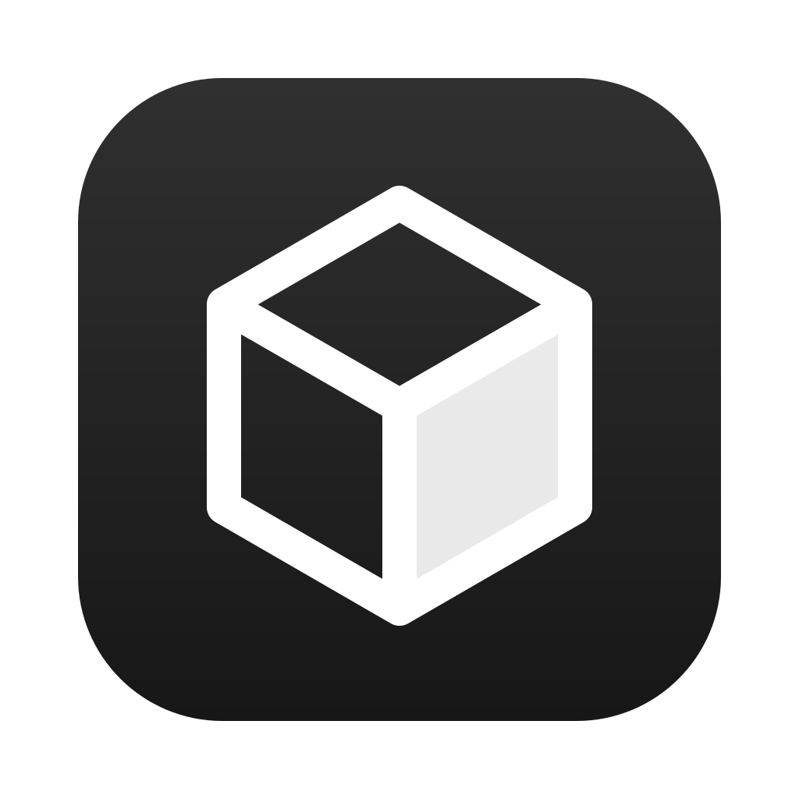

# ClashCube

**为 [mihomo](https://github.com/MetaCubeX/mihomo) 打造的原生质感 macOS 菜单栏客户端。**
单一可执行文件，内核随应用编译，每份配置生效前都先经过校验。

[](LICENSE)


[English](README.md) · 简体中文

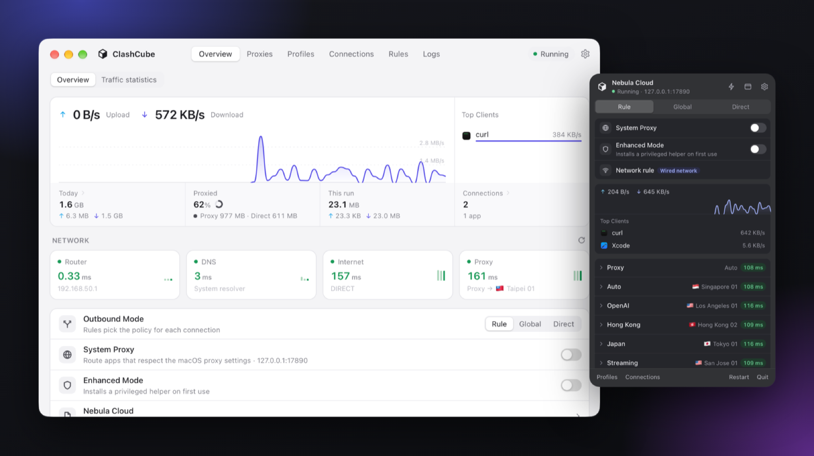

</div>

## 为什么选择 ClashCube

- **一个应用，没有外挂内核。** mihomo 从源码编译进应用，界面、代理内核和特权助手是同一个可执行文件的不同角色。不用单独下载内核、挑版本或手动替换，内核随应用一起升级。
- **坏配置不会让你断网。** 配置文件从不原地修改。ClashCube 把配置、模块、规则和设置合成一份运行时配置，先用 `core -t` 校验，通过后才启动或热重载。内核拒绝时，正在运行的配置保持不变，并显示内核给出的错误。
- **订阅更新不会冲掉你的改动。** 模块（兼容 Clash Verge 的扩展配置语法）和你自己的规则叠加在每份配置之上，服务商推送更新后依然生效。
- **默认安全。** 控制接口只监听 `127.0.0.1`，端口和 secret 每次启动随机生成。root 助手只接受四种操作，校验调用方 uid，只运行你自己的 `runtime.yaml`。助手更新用 ed25519 签名校验，升级应用不会再次索要密码。
- **用起来像 Mac 应用。** 交互参考 Surge for Mac：快速的托盘面板、紧凑的自绘托盘菜单、全局快捷键、浅色与深色主题、遵循“减弱动态效果”，概览页直接告诉你流量是否真的在走代理。
- **知道你在哪个网络。** 按 Wi-Fi SSID、有线网络或其他网络自动切换配置、出站模式、系统代理、TUN 和策略组选择。在 macOS 标记为按流量计费的网络上（个人热点、低数据模式）暂停后台更新和检测。

## 截图

<table>
  <tr>
    <td width="50%">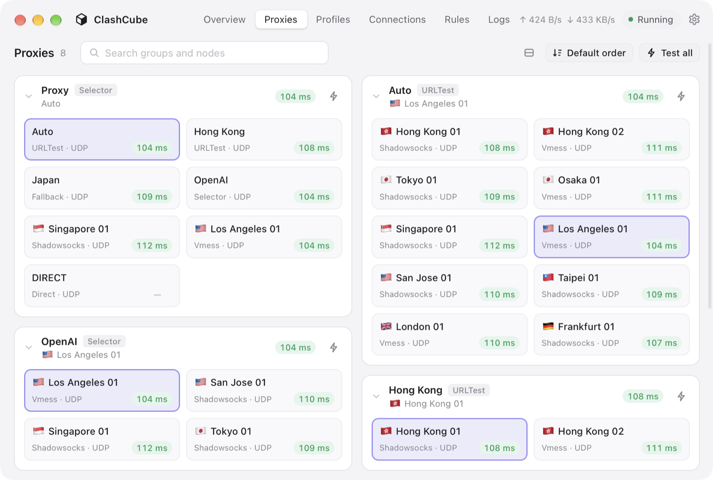<br><sub><b>代理</b>：策略组与节点，实时延迟；可测单个节点、整组或全部。</sub></td>
    <td width="50%">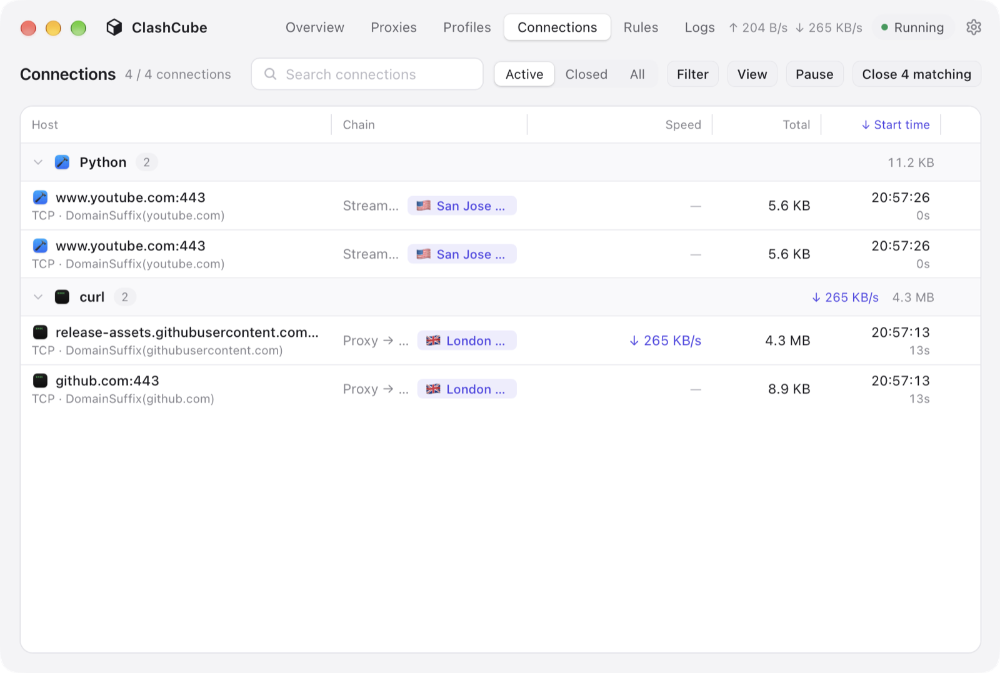<br><sub><b>连接</b>：按应用分组，显示命中规则和完整代理链；可筛选、暂停、断开。</sub></td>
  </tr>
  <tr>
    <td>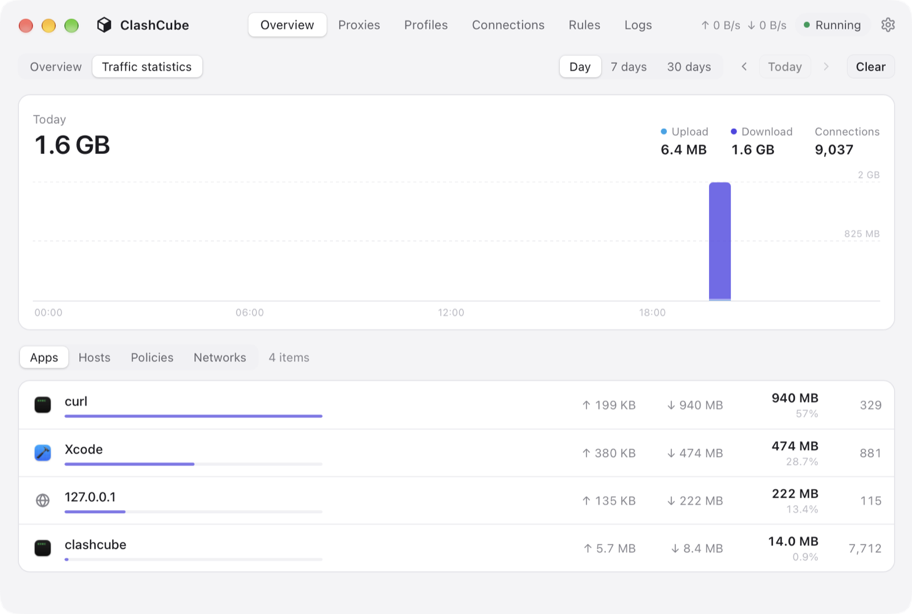<br><sub><b>流量统计</b>：按应用、主机、策略、网络，按小时统计，保留 90 天。</sub></td>
    <td>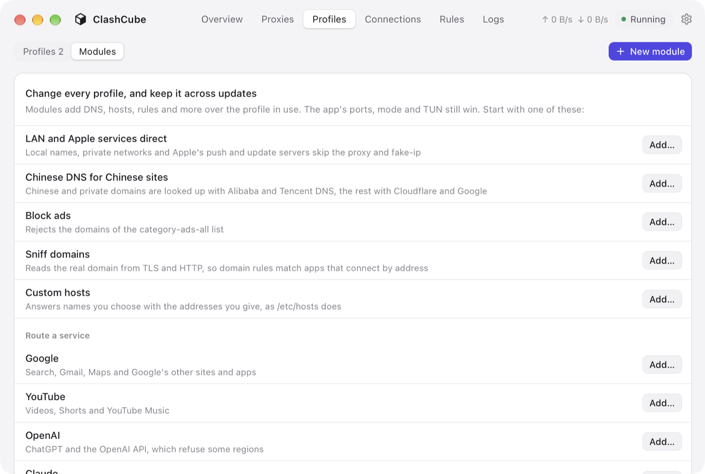<br><sub><b>模块</b>：DNS、去广告、域名嗅探、服务分流（OpenAI、Claude、Google、YouTube、Telegram…）一键添加。</sub></td>
  </tr>
  <tr>
    <td>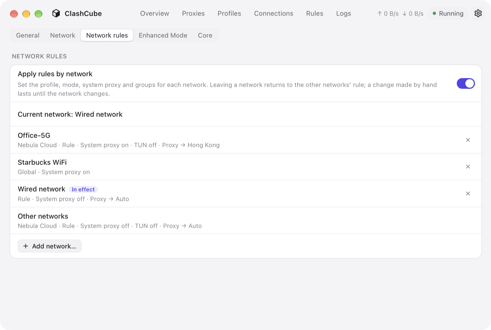<br><sub><b>网络规则</b>：Wi-Fi、有线和其他网络各自一套设置。</sub></td>
    <td>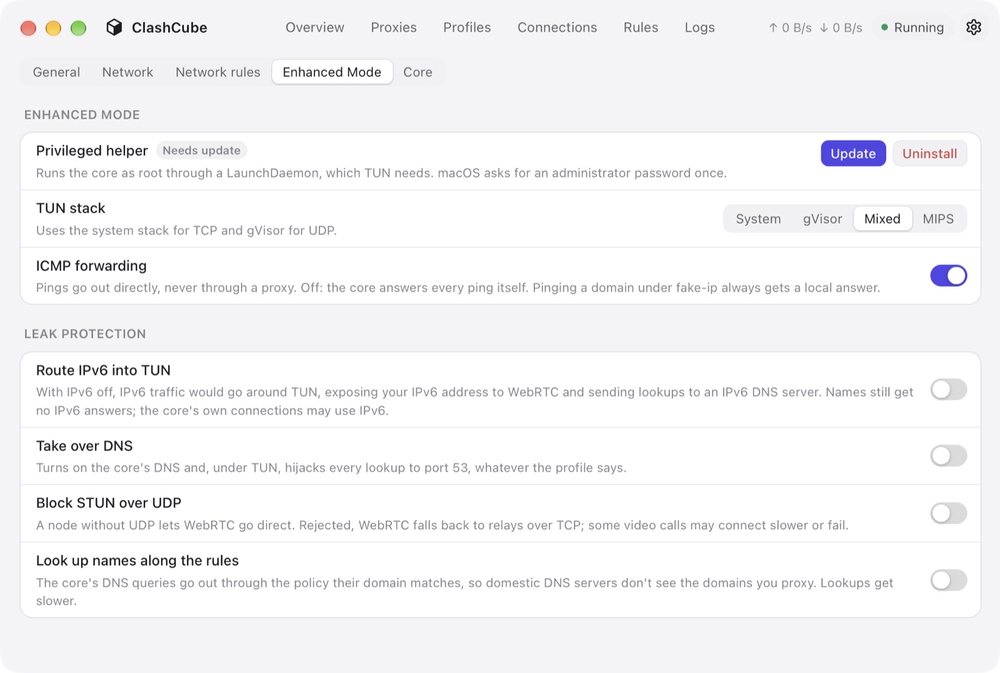<br><sub><b>增强模式（TUN）</b>：特权助手，以及 IPv6、DNS、STUN、域名查询的防泄露选项。</sub></td>
  </tr>
  <tr>
    <td>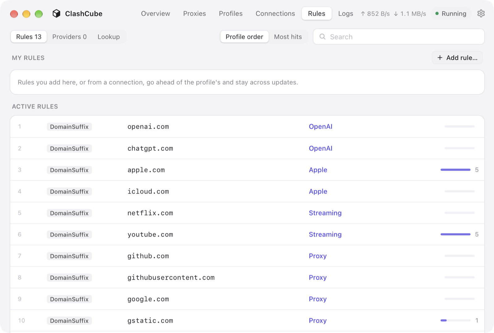<br><sub><b>规则</b>：生效规则与命中次数、规则集，以及解释某个域名会走哪条规则的查询工具。</sub></td>
    <td>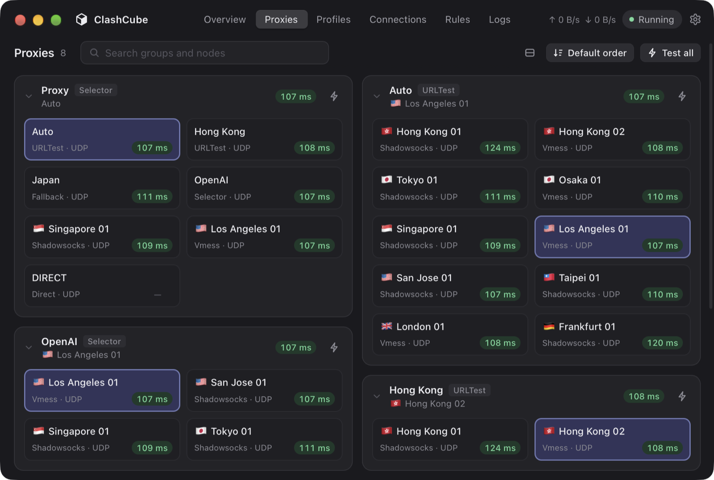<br><sub><b>深色模式</b>：跟随系统，或手动指定。</sub></td>
  </tr>
</table>

<p align="center">
  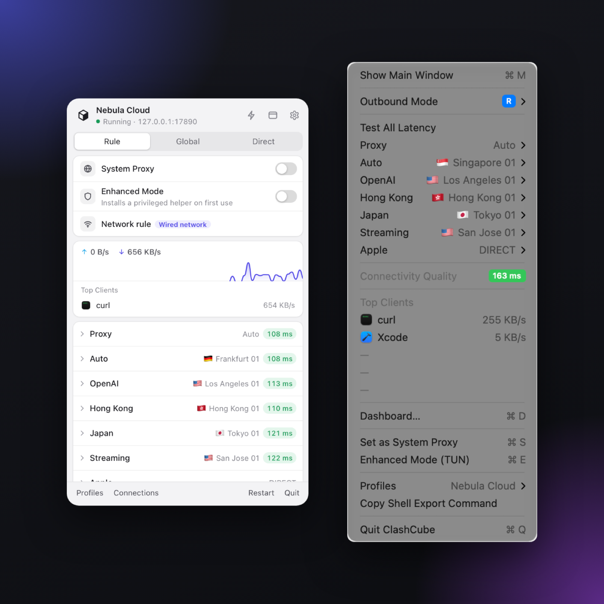<br>
  <sub>左键打开面板，右键打开菜单。不打开窗口就能切换模式、节点、系统代理和 TUN。</sub>
</p>

## 功能

**日常使用**
- 菜单栏面板，以及包含全部策略组、延迟、连通质量和活跃应用的右键菜单
- 出站模式（规则 / 全局 / 直连）、系统代理、TUN 三者独立
- 托盘图标反映流量是否真的被接管；可在旁边显示实时网速
- 全局快捷键（Carbon 实现，不需要辅助功能权限），带冲突检测
- 一键复制终端代理命令
- 内核停止、配置更新被拒绝或失败、网络规则生效、系统代理被其他应用改写时发送通知

**配置与规则**
- 从订阅链接、本地文件或 `clash://` / `clashmeta://install-config` 链接导入
- 读取 `subscription-userinfo` 显示剩余流量和到期时间；定时更新
- 正在使用的配置在磁盘上被修改时自动热重载
- 模块：深度合并，`+key` / `key+` / `key!`，`prepend-/append-rules`，`-proxies`，`-proxy-groups`
- 服务分流：把某个服务发往指定地区、节点列表或关键词，范围为空时 `REJECT`，不会悄悄直连
- 自定义规则（手动添加或从连接一键生成），优先于配置自带规则

**可观测性**
- 概览：实时速率、今日流量、代理占比、活跃应用，以及路由器、DNS、互联网、代理四项连通检测
- 连接：活跃与已关闭，按应用分组，可选列、搜索与筛选
- 流量统计按应用、主机、策略、网络归类；应用的辅助进程计入所属应用
- 规则命中次数，以及查询某个域名命中哪条规则
- 内核日志与应用事件记录

**网络**
- 按 SSID / 有线 / 其他网络的网络规则，结果确定、可还原
- 换网和唤醒时清空 DNS 与 fake-ip 缓存、关闭旧连接、重新设置系统代理
- 发现系统代理被其他应用改写时提示重新接管
- TUN 协议栈：System、gVisor、Mixed、MIPS；ICMP 转发
- 防泄露：IPv6 流量进入 TUN、接管 DNS、拦截 UDP STUN、DNS 查询遵循规则

**内核**
- 从源码编译 mihomo，使用的分支额外支持 OpenConnect（兼容 AnyConnect）出站和 ClashCube 需要的回调
- 内核是独立进程（仅 TUN 模式下以 root 运行），崩溃不会带走界面

## 安装

> [!NOTE]
> ClashCube 暂未公证，发布版本为 ad-hoc 签名。

1. 从 [Releases](https://github.com/clash-cube/clash-cube/releases) 下载 `macos-arm64.dmg`（Apple Silicon）或 `macos-amd64.dmg`（Intel），把应用拖进“应用程序”。
2. 首次打开被 macOS 拦截后，在确认下载可信的前提下，前往“系统设置 → 隐私与安全性 → 仍要打开”。
3. 在“配置 → 导入”添加订阅，然后打开“系统代理”或“增强模式”。

第一次打开增强模式时会安装 LaunchDaemon 助手，并请求一次管理员密码。

## 从源码构建

维护者请参考[发布流程](docs/releasing.md)，配置签名、版本 tag 和 Release 草稿。仓库仍为私有时，下载需要仓库访问权限。

需要 macOS 12+、Xcode 命令行工具、Go 1.25+、Node 与 pnpm，以及 Wails v3 CLI：

```sh
go install github.com/wailsapp/wails/v3/cmd/wails3@v3.0.0-beta.27
```

```sh
git clone --recursive https://github.com/clash-cube/clash-cube.git
cd clash-cube
wails3 task deps        # 子模块 + pnpm install
wails3 task run         # 开发构建并打开主窗口
wails3 task app         # bin/ClashCube.app（ad-hoc 签名）
wails3 task dmg         # bin/ClashCube.dmg
wails3 task install     # 替换 ~/Applications/ClashCube.app 并重新打开
wails3 task test        # Go 测试（会启动真实内核）、类型检查、前端测试
```

试用开发版本时，给它独立的数据目录和端口，避免影响真实数据：

```sh
CLASHCUBE_HOME=/tmp/cc ./bin/clashcube    # 然后把混合端口改成 7890 以外的值
```

## 工作原理

```
ClashCube.app/Contents/MacOS/clashcube
├── （无参数）     GUI：Wails v3 托盘面板 + 主窗口；只通过 REST/WebSocket 访问内核
├── core          进程内运行 mihomo，控制接口 127.0.0.1:<随机端口>，secret 随机
└── helper serve  root LaunchDaemon，为 TUN 拉起 core；只有 4 种操作，校验对端 uid
```

| 路径 | 内容 |
|---|---|
| `main.go` | 分发 GUI / `core` / `helper` 角色 |
| `internal/backend` | 不含窗口的应用逻辑：设置、配置、内核、系统代理、网络 |
| `internal/runtimecfg` | 由配置、模块、规则和设置生成 `runtime.yaml` |
| `internal/coremgr` | 启动、监控和停止内核进程 |
| `internal/helper` | 特权助手及其签名自更新 |
| `internal/gui` | Wails 服务、事件、托盘菜单和窗口 |
| `frontend/` | React + TypeScript 界面 |
| `third_party/mihomo` | mihomo 分支（子模块） |

架构、安全模型和配置生成规则详见 [docs/design.md](docs/design.md)。

## 参与贡献

欢迎提交 Issue 和 Pull Request。较大的改动请先阅读 [docs/design.md](docs/design.md) 和 [AGENTS.md](AGENTS.md)，后者列出了构建、测试和界面约定。属于 mihomo 的修复请提交到 [分支仓库](https://github.com/Demogorgon314/mihomo/tree/openconnect-support)，不要在这里绕过。

## 致谢

- [mihomo](https://github.com/MetaCubeX/mihomo)：代理内核
- [Wails](https://wails.io)：Go + Web 界面的桌面应用框架
- [Surge for Mac](https://nssurge.com)：ClashCube 交互的参照
- [Clash Verge Rev](https://github.com/clash-verge-rev/clash-verge-rev) 与 [zashboard](https://github.com/Zephyruso/zashboard)：模块语法与测速行为的参照
- [three.js](https://threejs.org)：绘制地球
- [Solar System Scope](https://www.solarsystemscope.com/textures/)：地球的昼夜贴图（CC BY 4.0，已缩小）

## 许可证

[GPL-3.0](LICENSE)。mihomo 采用 GPL-3.0 并链接进二进制，因此 ClashCube 以相同许可证发布。
